# AI Co-Pilot Coach (vv) vv-pack-1.7.0

<p align="center">
  
</p>

<p align="center"><em>Same two letters. The difference is that vv already knows where you left off.</em></p>

<p align="center">
  
</p>

<p align="center"><em>And when something would touch the real world, it stops and asks first.</em></p>

<p align="center">
  <a href="https://github.com/vivi911/vv-conductor-public/stargazers"></a>
  <a href="LICENSE"></a>
  
</p>

繁體中文版請看 [`zh-TW/README.md`](zh-TW/README.md)。

> The first time, it helps you safely finish one small task; after that, memory, dispatch, and verification kick in.

This is a public package for people and AI to work together.

## Who Is Vivi

Vivi is the creator of GoAskVivi, who has spent a long time working with Codex, Claude Code, and various AI tools on real projects — writing documents, breaking down tasks, building websites, fixing workflows, organizing knowledge, and verifying results.

## Why the AI Co-Pilot Coach Exists

For the past 7 months, Vivi has spent almost every day working with AI more than 10 hours at a stretch — writing documents, breaking down tasks, building websites, fixing workflows, verifying launches. Along the way she hit plenty of potholes: the AI would edit files it shouldn't, forget who she was, break something live on its own, turn a small thing into a huge project, or say "done" when it had never actually verified anything.

The AI co-pilot coach is those 7 months and 10+ hours a day of hard-won lessons, distilled into a rulebook. What used to be a standalone "kickoff playbook" has now been folded into the safe first-use flow, still backed by the vv Conductor for memory, dispatch, and verification.

Its goal is simple: give someone brand new to working with AI the feeling of having a driving instructor sitting next to them. You hold the wheel (you decide), the AI drives (it does the work), and vv watches the road, warns you, and hits the brakes when needed — steering the AI where you want it to go, without letting it wander off, crash into something, or cause a mess.

## How to Get to Know Vivi

To learn about Vivi and GoAskVivi's approach to working with AI, start with the website — GoAskVivi is where Vivi shares real-world AI practice, Vibe Coding philosophy, and online courses:
https://goaskvivi.com/

If you're in Taiwan, add Vivi's LINE official account. You can ask questions directly when you're stuck, and you'll get vv update notifications too:
https://lin.ee/ZgPigfa

If you're in Hong Kong or mainland China, open the Xiaohongshu (RED) app and search ID `940160605` (account: Vivi | 22 years in brand strategy | AI practitioner). Follow and DM.

## What This Is

If this is your first time seeing this repo, think of it as a bundle of "AI work-coach configuration files."

It's not a tool you need to read code to understand — it's a set of `.md` files. `.md` just means Markdown documents — in plain terms, a work manual that both the AI and you can read.

The AI co-pilot coach isn't just about teaching you "how to prompt AI." The first time you use it, it asks what you want to do, explains the real risk clearly, and shrinks the task down to a safe first version; only after you finish that first thing do you decide whether to set up long-term memory.

Once you download this package, you don't just get a generic chat prompt — you get a full set of safe-start, memory, dispatch, and acceptance rules for Codex or Claude Code to work by.

You can call it `vv`, or you can call it `vivi` — both work exactly the same way. **vv is your own personal AI coach** — not a one-time thing. From now on, every time you open a new conversation, type `vv` or `vivi` to call it up. It looks at who you are and what's currently in flight first, then decides whether this can be done automatically or needs to stop and ask you.

It has global memory — this memory store is called the **Vault**. You can write your background, project status, and no-go zones into `~/vv-memory/` (your Vault), so the AI remembers who you are, where your projects stand, what you've worked on together before, and what it must never touch.

Most AI feels like it has amnesia — every new conversation, you have to re-explain who you are. The Vault is what lets the AI "remember you." The Vault is an advanced, long-term coaching feature — not a quiz you have to pass before your first task. Once it's set up, every time you type `hi`, `vivi`, `vv`, or `vv vault`, it reads the Vault first and continues from where you left off.

It also has a boot-up rule. From now on, when you open a new conversation, just type `vv` or `vivi` and it pulls the latest state and progress before continuing the conversation — no need to re-explain "who I am, where we left off, what's stuck" every single time.

It also comes with a set of development-role agents that can break a project into different roles to help you: a PM to clarify requirements, an architect to think through data flow and system design, a UX role to check the user experience, a builder to implement it, a tester to find problems, and a release role to run pre-launch checks. You don't need a fully formed idea up front — vv will help you turn a vague thought into a workable plan, step by step.

The point of this version isn't to turn AI into an all-powerful assistant — it's to make sure the AI knows three things first:

1. Who you are.
2. What you currently have in flight.
3. What can be done automatically, and what must always stop and ask you first.

If this is your first time opening this, read in this order:

1. `README.md`: what you're reading now — get familiar with how the whole package works first.
2. `conductor.md`: the AI's core rulebook — task judgment, dispatch, authorization, verification.
3. `boss-view.md`: use this every day or every time you start work, to have the AI prioritize from a boss's vantage point first.
4. `skills/vv-conductor/references/beginner-safety-start.md`: the safe first-use flow.
5. `skills/vv-conductor/memory-templates/`: turn your background, projects, and work rules into files the AI can read.
6. `skills/vv-conductor/onboarding.md`: the 7-question flow to build long-term memory, once you want the AI to remember you long-term.

## How to Use vv Day to Day (just remember one word: `vv` or `vivi`)

Every time you open a new conversation, just type `vv` or `vivi` — **you don't need to remember "what do I type the first time" vs. "what do I type to check memory," just pick one of the two words and stick with it.** As long as you've already built a Vault, it automatically reads memory first, tells you where you left off, what the next step is, and which projects are still unfinished — you don't have to ask separately.

```text
vv
```

```text
You're back — last time we got to XX, next step is YY. You've also got [Project A] stuck at [next step] and [Project B] not started yet — which one do you want to pick up?
```

`hi`, `vivi`, `conductor`, `AI co-pilot coach`, `vv vault` all wake it up too, exactly the same way — those are just backup phrasings you don't need to specifically remember; `vv` or `vivi` is enough.

Once it's awake, just say what you want, for example:

```text
vv, what should I do first today?
vv, help me break this idea into a plan I can start building.
vv, can this run automatically, or does it need my sign-off?
```

One sentence: **open a conversation → type `vv` or `vivi` → say what you want to do**. No commands to memorize, no complicated prompts to write.

## What Changed from v1.5 to v1.6

| v1.5 | v1.6 |
|---|---|
| Focused on "execution rules": task tiers, dispatch, red/yellow/green authorization, verification, stop-loss | Adds a "memory entry point": the AI gets to know you first, then starts working safely |
| The AI mainly read `conductor.md` when starting work | The AI reads the memory signal first, then `conductor.md` |
| Better suited to someone who already has a fixed AI workflow | Better suited to someone adopting an AI work hub for the first time |
| Progress handed off via `HANDOFF-LATEST.md` | Progress still uses handoff, but adds "Boss View" to remind you of forgotten items |

One sentence:

v1.5 was "safety rules for before the AI acts."
vv-pack-1.7.0 is "safely finish the first thing, then decide whether to let the AI get to know you long-term."

## Who This Package Is For

- Founders, managers, consultants, freelancers.
- Anyone juggling a lot of projects who often forgets what's where.
- Anyone who wants Claude Code, Codex, or other AI tools to help break down tasks, write documents, write code, and verify results.
- Anyone tired of re-explaining their background, rules, and no-go zones every single time.

## First, Download This Package to Your Computer

Every step after this starts from the copy on your own computer, so grab it first.

Open "Terminal," paste the whole block below, and hit Enter:

```bash
git clone https://github.com/vivi911/vv-conductor-public.git ~/vv-conductor-public
```

Once it's done, the package will be in your home directory, at `~/vv-conductor-public`. `~` is just your personal folder — you don't need to go find where that is.

Every command in this README afterward assumes this path — paste them as-is. If you want to put it somewhere else, remember to change the path in every following command too.

To confirm it downloaded successfully, paste this — it'll list the package's files:

```bash
ls ~/vv-conductor-public
```

## How Codex / Claude Code Use It

Both Codex and Claude Code can use this package. They install the same `vv-conductor` skill — only the folder name differs.

The difference isn't whether you *can* install it — it's what you'll actually use each one for.

### Codex: more like a hands-on build bench

Codex is a good fit for:

- Reading the repo, editing files, running tests.
- Judging red/yellow/green authorization — knowing what can run automatically and what needs to stop and ask first.
- Picking up `HANDOFF-LATEST.md` so you don't have to re-explain project progress every time.
- Breaking an engineering or documentation task into verifiable steps.

### Claude Code: more like a strategy room that thinks things through with you

Claude Code is a good fit for:

- Helping you organize ideas, write copy, write decks, work through strategy.
- Prioritizing from a boss's vantage point (Boss View).
- Continuing the same working habits, based on your memory and rules.

The AI co-pilot coach makes sure both sides run on the same set of rules. It's completely fine to install it in both — each reads its own folder, they don't conflict.

## Official Skill Installation (Codex / Claude Code — pick one, or install both)

Once installed, vv becomes a fixed trigger: type `hi`, `vivi`, `vv`, or `conductor`, and it automatically reads this rulebook — no need to paste the files in every time.

Installation is identical on both sides, only the folder name differs. Paste whichever section matches what you use.

### If you use Codex

```bash
mkdir -p ~/.codex/skills
cp -R ~/vv-conductor-public/skills/vv-conductor ~/.codex/skills/vv-conductor
```

### If you use Claude Code

```bash
mkdir -p ~/.claude/skills
cp -R ~/vv-conductor-public/skills/vv-conductor ~/.claude/skills/vv-conductor
```

If you use both, paste both sections — each installs independently and won't conflict.

After installing, **restart** Codex or Claude Code. When you say `hi`, `vivi`, `AI co-pilot coach`, `kickoff playbook`, `vv`, `conductor`, `what should I do today`, `dispatch`, `red/yellow/green`, or `handoff`, it'll trigger this skill.

To confirm it installed correctly, paste this (seeing files listed means success):

```bash
ls ~/.codex/skills/vv-conductor    # if you use Codex
ls ~/.claude/skills/vv-conductor   # if you use Claude Code
```

## Checking for Updates

vv never silently updates itself in the background — it's just a set of `.md` rule files, not an app.

But you can ask Codex or Claude Code to check GitHub for a newer version:

```text
vv check for updates
```

It compares your local install against the public GitHub package:

- GitHub package: `https://github.com/vivi911/vv-conductor-public`
- Locally installed skill: `~/.codex/skills/vv-conductor/` for Codex, `~/.claude/skills/vv-conductor/` for Claude Code
- Version files: the `VERSION` file at the repo root, and the `VERSION` file inside the installed folder

If GitHub has a newer version, you need to re-download the repo and overwrite the local skill. Just seeing that GitHub has an update isn't enough — what the AI actually reads is the folder on your own computer.

## Updating vv

When a new version comes out, it's two steps: pull the repo to the latest version, then overwrite your local install.

```bash
cd ~/vv-conductor-public && git pull
```

```bash
cp -R ~/vv-conductor-public/skills/vv-conductor ~/.codex/skills/vv-conductor    # if you use Codex
cp -R ~/vv-conductor-public/skills/vv-conductor ~/.claude/skills/vv-conductor   # if you use Claude Code
```

What the AI actually reads is the files in `~/.codex/skills/vv-conductor/` (or `~/.claude/skills/vv-conductor/` for Claude Code). If you only pull the repo to the latest version without overwriting the local skill, new conversations will keep running the old version.

If you're not sure whether you're on the latest version, just ask:

```text
vv check for updates
```

## Before You Modify This Package (for people who want to customize it)

The same rule in this package often lives in several files: `SKILL.md` (what the AI reads), `conductor.md` (the human-readable mirror), `onboarding.md` (the first-use flow). **Edit one and forget another, and the rules will silently contradict each other** — the AI just quietly picks a different behavior.

So always run this after any edit:

```bash
python3 ~/vv-conductor-public/scripts/check-consistency.py
```

It scans every rule file, checking whether cross-file rules line up, whether anything required got dropped, and whether any file references are broken. Don't publish if it isn't green.

## Manual Usage (Without Installing the Skill)

If you don't want to install it as a skill, you can also use it purely manually. First, copy `conductor.md` to your home directory:

```bash
cp -n ~/vv-conductor-public/conductor.md ~/conductor.md
```

⚠️ **Don't drop the `-n`.** If you already have a `~/conductor.md` on your computer (say, from a previous install, or one you edited yourself), leaving out `-n` would overwrite it directly. If the command appears to do nothing, that's not a failure — it means your original file was protected from being overwritten. If you genuinely want to switch to the new version, manually check the old file for anything worth keeping first, then delete it and paste this command again.

Then copy `skills/vv-conductor/memory-templates/` to wherever you keep AI memory:

```bash
mkdir -p ~/vv-memory
cp -n ~/vv-conductor-public/skills/vv-conductor/memory-templates/*.md ~/vv-memory/
```

⚠️ **Don't drop that `-n` either.** It means "skip any file that already exists."

`~/vv-memory/` is **your own** memory store. Without `-n`, pasting this command again someday would wipe out everything you've accumulated with the blank template — and you wouldn't be able to get it back.

To update this package later, **you only need to reinstall the skill** — you don't need to touch this folder again.

Then, at the start of an AI conversation, paste:

```text
Please read ~/conductor.md first and enter AI co-pilot coach mode. Help me safely finish one small task first; once I agree to set up long-term memory, read ~/vv-memory/00_index.md.
```

## What to Do the First Time

After installing, open a new conversation and just type:

```text
hi
```

The AI co-pilot coach will first ask: "What's the one thing you most want Codex or Claude Code to help you with right now?" Then it'll help you clarify the risk and shrink it to a safe first version — it won't throw a 7-question quiz at you first.

After you finish that first safe task, if you'd like it to remember your background, progress, and no-go zones next time, just reply:

```text
Help me build a Vault.
```

Only then will it open `onboarding.md` and walk you through the 7 questions, one at a time.

Once you've answered, organize your answers into:

- `~/vv-memory/01_who-i-am.md`
- `~/vv-memory/projects/<project-name>.md` (one file per project you mentioned, copied from `02_project-template.md` — don't cram them all into one file)
- `~/vv-memory/03_ai-work-rules.md`

You don't need to get it perfect on the first pass. vv asks the next question once you've answered the current one; v1.6's design is to get a first version in place, then let it grow over a week of actual work.

## Ways You Can Talk to vv

```text
hi
vv
vv vault
vv, what should I do first today?
vv, help me break this requirement into something I can start building.
vv, read my memory first, then judge whether this should be done.
vv, help me see where this project is currently stuck.
vv, can this run automatically? Or does it need my sign-off?
vv check for updates
```

If you just installed it and don't know where to start, you can also just ask:

```text
vv, what can you help me with?
What can you help me with?
vv, how do I use this?
How do I use this AI co-pilot coach?
What situations can I use this for?
I'm feeling a bit scattered right now — vv, what do you suggest I start with?
```

Any of these will get vv to explain what it can do in plain language, instead of immediately expecting you to understand every file.

## Common Usage Scenarios

### 1. Opening a new conversation: just type `hi` or `vivi`

From now on, whenever you open a new Codex or Claude Code conversation, start with:

```text
hi
```

(Typing `vivi` works exactly the same way.)

vv will first check your global memory entry points — things like the Vault, `~/vv-memory/`, or a project's `HANDOFF-LATEST.md` — to figure out what you've been working on lately, which projects are still unfinished, and where it needs your sign-off.

If this is your first time pulling this package down and you haven't built a Vault yet, typing `hi` or `vivi` won't error out — the AI co-pilot coach will introduce itself, then ask what you want to do, and help you safely finish your first small task. Only if you want long-term memory will it then use the 7 questions to build your first Vault.

If memory is connected, it'll continue the conversation from your latest progress. If you had memory before but it can't be read this time, it will say plainly "I can't read memory right now" — it won't pretend to know.

### 2. Not sure what to do first thing in the morning

```text
vv, what should I do first today?
```

vv will use the Boss View to look at things for you: what's most urgent, what's blocking money or a customer, which project has been sitting too long, and what's most worth pushing first today. It won't dump all the options back on you to pick from — it'll give you one recommendation first.

### 3. Your thinking is a mess and you're not ready to build anything

```text
vv, help me turn this idea into a plan I can start building.
```

vv will help break it down into requirements, blockers, completion criteria, and how to verify it. If needed, it'll use PM, architect, UX, builder, tester, and release role agents to work step by step through a vague idea and turn it into something clear.

### 4. Trying to figure out whether the AI can do it automatically

```text
vv, can this run automatically? Or does it need my sign-off?
```

vv will use the red/yellow/green rules to judge it: pure organizing, editing documents, and running local tests can usually run automatically; sending messages, going live, payments, deleting data, OAuth, and key rotation are all high-risk and will stop and ask you.

### 5. Picking a project back up partway through

```text
vv, help me see where this project is currently stuck.
```

vv will look for a handoff or project memory first, then summarize where things currently stand, what's actually wired up, what's still pending, and what's the best next step. This is the most important thing this package does: it lets the AI remember what you've worked on together, so you never have to re-explain it from scratch.

## File Structure

```text
vv-conductor-public/
├── README.md                    ← English (default)
├── VERSION
├── skill-index.md
├── conductor.md
├── boss-view.md
├── skills/
│   └── vv-conductor/
│       ├── SKILL.md
│       ├── VERSION
│       ├── onboarding.md
│       ├── agents/
│       │   └── openai.yaml
│       ├── memory-templates/
│       │   ├── 00_index.md
│       │   ├── 01_who-i-am.md
│       │   ├── 02_project-template.md
│       │   └── 03_ai-work-rules.md
│       └── references/
│           ├── memory-template-guide.md
│           ├── beginner-safety-start.md
│           ├── package-maintenance.md
│           └── vv-conductor-reference.md
└── zh-TW/                       ← Traditional Chinese mirror
    ├── README.md
    ├── VERSION
    ├── skill-index.md
    ├── 指揮家.md
    ├── vv-老闆視角.md
    └── skills/
        └── vv-conductor/
            ├── SKILL.md
            ├── VERSION
            ├── onboarding.md
            ├── agents/
            │   └── openai.yaml
            ├── memory-templates/
            │   ├── 00_索引.md
            │   ├── 01_我是誰.md
            │   ├── 02_專案範本.md
            │   └── 03_給AI的工作規則.md
            └── references/
                ├── memory-template-guide.md
                ├── beginner-safety-start.md
                ├── package-maintenance.md
                └── vv-conductor-reference.md
```

`onboarding.md` and `memory-templates/` both live inside the skill folder, so the AI can find them after you install it. The install command only copies `skills/vv-conductor` (or `zh-TW/skills/vv-conductor`) — anything outside that folder doesn't come along.

## This Package Currently Has Three Layers

### 1. Public documents, for humans to read

- `README.md`
- `VERSION`
- `conductor.md`
- `boss-view.md`

### 2. Memory templates (blank masters, installed together with the skill)

- `skills/vv-conductor/memory-templates/00_index.md`
- `skills/vv-conductor/memory-templates/01_who-i-am.md`
- `skills/vv-conductor/memory-templates/02_project-template.md`
- `skills/vv-conductor/memory-templates/03_ai-work-rules.md`

These four are **blank masters** — never fill them in directly here, since the whole folder gets overwritten whenever you update the package. Copy them to your own memory store first (default `~/vv-memory/`), and fill them in there.

### 3. The official skill

- `skill-index.md`
- `skills/vv-conductor/SKILL.md`
- `skills/vv-conductor/VERSION`
- `skills/vv-conductor/onboarding.md`
- `skills/vv-conductor/agents/openai.yaml`
- `skills/vv-conductor/references/*.md`
